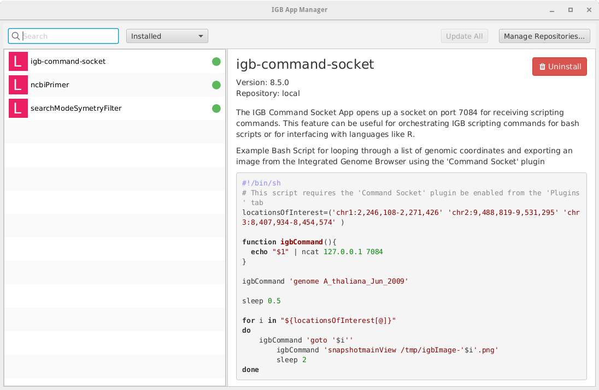

# IGB NEWS 

* * *

### June 7, 2016: IGB-fx prototype available - Great new features on the way

The IGB team is buildig a new version of IGB that uses JavaFX
and 100% modular, services-based programming with OSGi. 
A prototype version for developers is available from the
[IGB-fx source code repository](https://bitbucket.org/lorainelab/igb-fx).

We're building this new version of IGB from the ground up, focusing
on transforming IGB into a platform even beginning programmers can
use to create stunning new visualizations for new types of genomic data - 
like 2-dimensional genome graphs from Hi-C data. 

By using JavaFX - an advanced graphics toolkit that replaces Java
Swing - we can implement many sophisticated new user interface
features, like new and improved panning scrollbars that adjust the
scroll rate for the zoom level. JavaFX also lets us continue to provide
fast, animated, one-D zooming from chromosome to base pair and back again.

Another new development is that we're improving our favorite method of
sharing and publishing data - IGB Quickload. Starting with IGB-fx,
you'll be able to open and load data from cloud storage accounts like
Google Drive and Dropbox. 

You'll also be able to share your data with colleagues and
collaborators, using the same user-friendly access controls you
already use to share ordinary documents. When you change
track colors, names and otherwise modify the appearance of data, you
have the option to save your settings so that other people will see
the same thing when they open your files.

At least for now, academic users with Google accounts through their 
insitutions have no limits on the amount of data they can store. We're
excited about helping IGB users take full advantage of this exciting 
feature. 

* * *

### June 6, 2016: IGB 9.0.0 released

Today we released IGB 9.0.0, a major version release that includes API improvements, performance improvements, and bug fixes. 

* New Menu API (see [developers guide](https://wiki.transvar.org/display/igbdevelopers))
* Better support for narrowPeak files - from ChIP-Seq experiments ([IGBF-1115](https://jira.transvar.org/browse/IGBF-1115))
* Performance improvements when working with large Quickload sites ([IGBF-1114](https://jira.transvar.org/browse/IGBF-1114))
* Fixing caching error when IGB closes during download ([IGBF-1110](https://jira.transvar.org/browse/IGBF-1110))
* Fixing exception when sorting the Size column in the Cache tab ([IGBF-1111](https://jira.transvar.org/browse/IGBF-1111))

* * *
### April 2016 - Two new IGB papers published

The journal Bioinformatics has published two new papers on IGB and IGB Apps:

* Freese NH, Norris DC, Loraine AE. Integrated genome browser: visual analytics platform for genomics. Bioinformatics. 2016 Mar 16. pii: btw069. [Read Article](http://www.ncbi.nlm.nih.gov/pubmed/27153568)

* Mall T, Eckstein J, Norris D, Vora H, Freese NH, Loraine AE. ProtAnnot: an App for Integrated Genome Browser to display how alternative splicing and transcription affect proteins. Bioinformatics. 2016 Apr 7. pii: btw068. [Read Article](http://www.ncbi.nlm.nih.gov/pubmed/27153567)

* * *
### March 31, 2016: IGB 8.5.4 released

Today we released IGB 8.5.4, a minor release that includes only cosmetic changes

* App Manager Menu Item added ([IGBF-1104](https://jira.transvar.org/browse/IGBF-1104))
* Reorder welcome screen species ([IGBF-1105](https://jira.transvar.org/browse/IGBF-1105))

* * *

### March 18, 2016: IGB 8.5.3 released

Today we released IGB 8.5.3, a minor release that includes a few minor bug fixes

* Adding Synonym File removes Data Sources Tab ([IGBF-1077](https://jira.transvar.org/browse/IGBF-1077))
* "i" button should not be shown if optional url attribute not present ([IGBF-1068](https://jira.transvar.org/browse/IGBF-1068))
* Opening a file by dragging-and-dropping causes freezing on Mac ([IGBF-1079](https://jira.transvar.org/browse/IGBF-1079))
* Find Junctions Only Counting Single-mapping reads ([IGBF-1031](https://jira.transvar.org/browse/IGBF-1031))
* VCF parsing error when average quality is empty string ([IGBF-1101](https://jira.transvar.org/browse/IGBF-1101))

* * *

### January 20, 2016: IGB paper accepted for publication

It's official: Bioinformatics has accepted our revised manuscript describing the latest version of IGB.

To see a preprint of this paper and also the ProtAnnot paper, which was accepted for publication last month, see:

* Integrated Genome Browser: visual analytics platform for genomics - <a href="http://biorxiv.org/content/early/2015/09/08/026351">Preprint</a>
* ProtAnnot: an App for Integrated Genome Browser to display how alternative splicing and transcription affect proteins - <a href="http://biorxiv.org/content/early/2015/11/26/025924">Preprint</a>

* * *

### January 8-13, 2016: IGB and ProtAnnot at Plant Animal Genome Conference

Ann and Nowlan are giving several presentations on IGB and ProtAnnot during the 2016 Plant Animal Genome Conference in San Diego, including:

* A talk introducing ProtAnnot (Ann) during the <a href="https://pag.confex.com/pag/xxiv/meetingapp.cgi/Session/3052">Arabidopsis Information Portal</a> workshop - <a href="http://www.slideshare.net/AnnLoraine/introducing-protannot-araport-workshop-at-pag-2016">slides on Slideshare</a>
* Live demos of IGB and ProtAnnot (Ann and Nowlan) during the <a href="https://pag.confex.com/pag/xxiv/meetingapp.cgi/Session/3271">Wed afternoon Computer Demo</a> session
* A talk on the blueberry genome featuring IGB (Ann) during the <a href="https://pag.confex.com/pag/xxiv/meetingapp.cgi/Session/3094">Fruits and Nuts</a> session - <a href="http://www.slideshare.net/AnnLoraine/rnaseq-analysis-of-blueberry-fruit-development-and-ripening">slides on Slideshare</a>

We'll post links to slides and videos as soon as they're available. 
 
* * *

### December 21, 2015: IGB 8.5.2 released

Today we released IGB 8.5.2, a minor release that includes several bug fixes and a few small new features.

* Disable ability to store empty passwords on dataproviders  ([IGBF-1060](https://jira.transvar.org/browse/IGBF-1060))
* Improve error handling around data provider credentials ([IGBF-1051](https://jira.transvar.org/browse/IGBF-1051))
* Clearing data set fails when refreshing QL server on genomes with many contigs ([IGBF-1061](https://jira.transvar.org/browse/IGBF-1061))
* Symloaders not handling non-bed formats properly ([IGBF-1059](https://jira.transvar.org/browse/IGBF-1059))
* Insertion glyph not shown correctly ([IGBF-1057](https://jira.transvar.org/browse/IGBF-1057))
* Protannot paxml not recalled correctly ([IGBF-1001](https://jira.transvar.org/browse/IGBF-1001))
* Do not allow user to set Max Cache size lower than the current cache size ([IGBF-1019](https://jira.transvar.org/browse/IGBF-1019))
* Exception generated when trying to install an updatable plugin ([IGBF-1043](https://jira.transvar.org/browse/IGBF-1043))
* Exception generated when trying to install an updatable plugin ([IGBF-1018](https://jira.transvar.org/browse/IGBF-1018))
* Race condition vulnerability in bottom tabholder ([IGBF-1056](https://jira.transvar.org/browse/IGBF-1056))

* * *
### November 30, 2015: IGB 8.5.1 released

Today we released IGB 8.5.1, a minor release that includes a single bug fix.

* Remote Wig File loading fails ([IGBF-1046](https://jira.transvar.org/browse/IGBF-1046)) 

* * *
### November 20, 2015: IGB 8.5.0 released

Today we released IGB 8.5.0, a major release that includes many new features and improvements. 

* Introduced support for narrowPeak and broadPeak file formats ([IGBF-1005](https://jira.transvar.org/browse/IGBF-1005))
* Introduced a new caching system to improve performance and speed up data access of commonly accessed files ([IGBF-442](https://jira.transvar.org/browse/IGBF-442))
* Introduced a App Manager created with JavaFx ([IGBF-959](https://jira.transvar.org/browse/IGBF-959))

* Added a bundled JRE for the linux distribution ([IGBF-1000](https://jira.transvar.org/browse/IGBF-1000))
* Added support for a new index attribute to the quickload annots.xml file tag ([IGBF-445](https://jira.transvar.org/browse/IGBF-445))
* Improved error handling of broken quickload servers ([IGBF-808](https://jira.transvar.org/browse/IGBF-808))
* Introduced support for unsorted bed files ([IGBF-1020](https://jira.transvar.org/browse/IGBF-1020))
* Enable javafx file chooser in custom genome dialog ([IGBF-795](https://jira.transvar.org/browse/IGBF-795))
* Make the "Save Password" checkbox checked by default ([IGBF-802](https://jira.transvar.org/browse/IGBF-802))
* Implement weight for items under Tools menu ([IGBF-841](https://jira.transvar.org/browse/IGBF-841))
* Refactor image export service to support plugins ([IGBF-974](https://jira.transvar.org/browse/IGBF-974))

* * *
### September 15, 2015: New IGB paper

A new paper describing IGB is available as [a preprint on BioRXiv.org](http://bit.ly/1KQEfga). Highlights include all new visual analytics tools for high throughput 
sequence data and the ability to add new features as IGB Apps (plug-ins), such as [ProtAnnot](http://bit.ly/1M9DQ5X).

* * *
### September 11, 2015: ProtAnnot plug-in for IGB

The IGB team released a new IGB App called ProtAnnot, which shows
protein motifs and annotations in the context of genomic
sequence. Using ProtAnnot, you can search Interpro for conserved
motifs and better understand gene function. You can read more about it
in the [ProtAnnot](http://bit.ly/1M9DQ5X) pre-print.

* * *
### September 8, 2015: IGB 8.4.4 released

Today we released IGB 8.4.4, a minor release that includes a patch for performance degrading while zooming into very large gene models with annotation labels set to "none".

* High level zoom on large genes is causing lag if label set to "none"  ([IGBF-933](https://jira.transvar.org/browse/IGBF-933))

* * *
### September 2, 2015: IGB 8.4.3 released

Today we released IGB 8.4.3, a minor release that includes a few enhancements to existing features, and patches for defects. 
A noteworthy patch is included for a serious bug in Ubuntu which causes the JVM to crash whenever a file chooser widget was presented for loading local files. 
We have reverted to using a non-native file chooser on Ubuntu as a workaround.

* IGB returns to default chromosome after removing any track. (local files only)  ([IGBF-915](https://jira.transvar.org/browse/IGBF-915))
* Remove checkboxes from bottom of plug-ins tab ([IGBF-914](https://jira.transvar.org/browse/IGBF-914))
* Bookmark module activation fails if menu depth exceeds 4 levels ([IGBF-903](https://jira.transvar.org/browse/IGBF-903))
* UriUtils does not properly handling http 500 response if initial validation returns 200 ([IGBF-902](https://jira.transvar.org/browse/IGBF-902))
* "Customize..." action should open to the "Tracks" tab in Preferences ([IGBF-882](https://jira.transvar.org/browse/IGBF-882))
* Restore JFileChooser and revert use of AWT FileDialog for Ubuntu ([IGBF-872](https://jira.transvar.org/browse/IGBF-872))
* Allow .svg export always, even Whole Frame ([IGBF-779](https://jira.transvar.org/browse/IGBF-779))

* * *
### August 10, 2015: IGB 8.4.2 released

Today we released IGB 8.4.2, a minor release which includes a variety of small bug fixes and user experience improvements.  This release also introduces a new plugin to our "Optional" plugins repository: the *ProtAnnot* plugin.  This plugin integrates a viewer which is designed to make it easy to see how alternative mRNA structures affect the various protein products encoded at a locus. We will be releasing a video tutorial soon to demonstrate the functionality of this new plugin.

* Improve user feedback when adding broken quickload sites ([IGBF-808](https://jira.transvar.org/browse/IGBF-808))
* Local species.txt is parsed incorrectly ([IGBF-796](https://jira.transvar.org/browse/IGBF-796))
* Spaces getting converted to "%20" in Data Sources table ([IGBF-748](https://jira.transvar.org/browse/IGBF-748)) 
* Editing URL of secured quickoad sites causes strange behavior in IGB including the inability to remove a data source ([IGBF-868](https://jira.transvar.org/browse/IGBF-868))
* Not selecting "Save Password" checkbox when adding two secured Quickoad sites causes too many popups to appear during a session ([IGBF-866](https://jira.transvar.org/browse/IGBF-866)) 
* Working with multiple secure quickload sites causes authentication popup to trigger unexpectedly ([IGBF-840](https://jira.transvar.org/browse/IGBF-840)) 

* * *

### July 25, 2015: MI bundle plug-in for IGB

Dr. Arnaud Céol from the Center for Genomic Science at the Italian Institute of Technology published a paper on the MI bundle, an IGB plug-in 
for mapping and visualizing genomic regions in molecular interactions structures. This plug-in allows researchers to identify potential functional 
impacts caused by mutations. The paper can be found at [http://bit.ly/1MpYkKH] (http://bit.ly/1MpYkKH), and more information at [http://cru.genomics.iit.it/igbmibundle/] (http://cru.genomics.iit.it/igbmibundle/).

* * *

### July 8, 2015: IGB 8.4.1 released

Today we released IGB 8.4.1, a minor release which resolves one significant regression in the IGB 8.4.0 release related to failing to properly preserve the track order. 
We have also included a few more minor improvements with this release.

*   Track Order is reverting to load order on chromosome change ([IGBF-793](https://jira.transvar.org/browse/IGBF-793))
*   The wrong column in species.txt used for species combobox ([IGBF-789](https://jira.transvar.org/browse/IGBF-789))
*   It's not possible to edit QL URL when it's "not responding" ([IGBF-788](https://jira.transvar.org/browse/IGBF-788))
*   It is possible to incorrectly persist a dataprovider's preference node ([IGBF-790](https://jira.transvar.org/browse/IGBF-790))

* * *
### July 6, 2015: IGB 8.4.0 released

Today we released IGB 8.4.0, a major release which includes several significant software architectural improvements. 
The improvements included in this release have mostly been aimed at enhancing the APIs exposed to plugin developers 
and making our code base more developer friendly; however, the release also contains many usability improvements 
and bug fixes.

*   DataProvider API introduced as a full replacement for SeverTypeI ([IGBF-663](https://jira.transvar.org/browse/IGBF-663))
*   IGB Quickload rewritten as a DataProvider implementation ([IGBF-783](https://jira.transvar.org/browse/IGBF-783))
*   Das rewritten as a DataProvider implementation ([IGBF-578](https://jira.transvar.org/browse/IGBF-578))
*   Das2 support restored as a DataProvider implementation ([IGBF-579](https://jira.transvar.org/browse/IGBF-579))
*   Fix for bug in the fasta parser ([IGBF-540](https://jira.transvar.org/browse/IGBF-540))
*   Annotation Font Label Options panel added to allow user to control the behavior of font label rendering ([IGBF-784](https://jira.transvar.org/browse/IGBF-784))
*   Export Image widget has been updated and several small bugs were resolved ([IGBF-719](https://jira.transvar.org/browse/IGBF-719), [IGBF-755](https://jira.transvar.org/browse/IGBF-755), [IGBF-719](https://jira.transvar.org/browse/IGBF-719))
*   IGB developer's guide updated to include examples of how to get started developing IGB plugins ([Developer's Guide] (https://wiki.transvar.org/display/igbdevelopers/IGB%27s+Modular+Architecture))

* * *
### May 12, 2015: IGB 8.3.4 released

Today we released IGB 8.3.4, a minor release which includes bug fixes and some improvements:

*   Graph Track Operations Usability Enhancements ([IGBF-635](https://jira.transvar.org/browse/IGBF-635))
*   Remove parameter input option for what should be hardcoded Track "Operators" ([IGBF-393](https://jira.transvar.org/browse/IGBF-393))
*   Examine and fix the synonym error in the C. elegans genome ([IGBF-538](https://jira.transvar.org/browse/IGBF-538))
*   Change the text in the MM8 genome from "March" to "Feb" ([IGBF-551](https://jira.transvar.org/browse/IGBF-551))
*   Create a nested folder inside the IGB.zip distribution ([IGBF-583](https://jira.transvar.org/browse/IGBF-583))
*   Fix "select" and "selectfeature" scripting commands, and update "loadmode" documentation to reflect actual options available ([IGBF-598](https://jira.transvar.org/browse/IGBF-598))
*   Remove Track Operation text and punctuation in Graph tab ([IGBF-606](https://jira.transvar.org/browse/IGBF-606))
*   Bed Symloader does not properly parse bedDetail type when the number of columns is less than 14 ([IGBF-619](https://jira.transvar.org/browse/IGBF-619))
*   Remove Input parameter box for Sqrt Graph Track Operation ([IGBF-643](https://jira.transvar.org/browse/IGBF-643))
*   Change minimum requirement for Residue Search to 1 character ([IGBF-644](https://jira.transvar.org/browse/IGBF-644))
*   Subtract Track Operation Works Differently if Commas are used in the Value ([IGBF-648](https://jira.transvar.org/browse/IGBF-648))
*   Selecting "Make Track" in the Graph Thresholds Dialogue generates an exception ([IGBF-610](https://jira.transvar.org/browse/IGBF-610))

* * *
### May 6, 2015: IGB 8.3.3 released

Today we released IGB 8.3.3, a minor release which includes only a single bug fix:

*   Data Sources become duplicated when re-enabling server or refreshing server ([IGBF-498](https://jira.transvar.org/browse/IGBF-498))

* * *
### March 30, 2015: IGB 8.3.2 released

Today we released IGB 8.3.2, a minor release which includes bug fixes and some improvements, such as:

*   Add support for other FASTA file extensions ([IGBF-414](https://jira.transvar.org/browse/IGBF-414))
*   Open Custom Genome improvements ([IGBF-479](https://jira.transvar.org/browse/IGBF-479))
*   Refactor and simplify Open File feature ([IGBF-377](https://jira.transvar.org/browse/IGBF-377)) 
*   Update Bundled JRE to resolve intermittent crashes on Mac OS X ([IGBF-380](https://jira.transvar.org/browse/IGBF-380)) 
*   Add "delete all tracks" IGB scripting command) ([IGBF-472](https://jira.transvar.org/browse/IGBF-472)) 
*   Bed Parser Minor Improvements to resolve issues related to optional bin field ([IGBF-512](https://jira.transvar.org/browse/IGBF-512))
*   GFF3 Tooltip duplicates removed ([IGBF-513](https://jira.transvar.org/browse/IGBF-513))
*   Advanced Search Tab "Gene Name" column should be renamed to Title and mapped to correct property ([IGBF-514](https://jira.transvar.org/browse/IGBF-514))

### February 23, 2015: IGB 8.3.1 released

Today we released IGB 8.3.1, a minor release which includes several bug fixes and small improvements

*   Added Customize option back to track label context menu ([IGBF-379](https://jira.transvar.org/browse/IGBF-379))
*   Open File Diaolog modifications made for native look and feel ([IGBF-377](https://jira.transvar.org/browse/IGBF-377)) 
*   Search indexing problem with GFF file format vs. BED-detail ([IGBF-23](https://jira.transvar.org/browse/IGBF-23)) 
*   Moved igb-command-socket module into optional plugins ([IGBF-417](https://jira.transvar.org/browse/IGBF-417))
*   Genome load mode doesn’t indicate loading has happened for chromosomes for which there was no data ([IGBF-378](https://jira.transvar.org/browse/IGBF-378))
*   Set home as default location for Open File dialogs ([IGBF-405](https://jira.transvar.org/browse/IGBF-405))
*   Nothing appears above Annotations when labeling by "Title" ([IGBF-387](https://jira.transvar.org/browse/IGBF-387))

* * *

### January 22, 2015: IGB 8.3.0 released

Today we released IGB 8.3.0, a milestone major release for the IGB project introducing native platform installers for Windows, Mac, and Linux.  This release does not contain any new major features, 
but does include many bug fixes.

*   Create Native Installers ([IGBF-347](https://jira.transvar.org/browse/IGBF-347))
*   Improve current filter for paired data ([IGBF-326](https://jira.transvar.org/browse/IGBF-326))
*   Dragging a file over an icon in the toolbar generates a NullPointerException ([IGBF-333](https://jira.transvar.org/browse/IGBF-333))
*   Sliced View tab intron selection causing an error ([IGBF-351](https://jira.transvar.org/browse/IGBF-351))
*   Ensembl External Viewer is Not Using Current Genome Version after URL change ([IGBF-354](https://jira.transvar.org/browse/IGBF-354))
*   Remove "Accept Network Connections" popup when launching IGB on a Mac ([IGBF-358](https://jira.transvar.org/browse/IGBF-358))
*   Right-clicking on track label when no data has been loaded generates an exception ([IGBF-346](https://jira.transvar.org/browse/IGBF-346))
*   Fix and Organize Developer Plugins ([IGBF-352](https://jira.transvar.org/browse/IGBF-352))
*   Fix NPE in Merge Annotation Operator Development Plugin ([IGBF-361](https://jira.transvar.org/browse/IGBF-361))
*   Tooltips are not displaying on Windows;generates a "BadLocationException" ([IGBF-336](https://jira.transvar.org/browse/IGBF-336))
*   Bottom of tooltips box may be cutoff ([IGBF-304](https://jira.transvar.org/browse/IGBF-304))
*   Put "cigar", "mapq", and "id" in all caps in tooltips/selection info ([IGBF-330](https://jira.transvar.org/browse/IGBF-330))
*   Typing zero into Export Image size parameter box causes annoying question mark to appear ([IGBF-252](https://jira.transvar.org/browse/IGBF-252))
*   Remove "Do you want to run script" dialog ([IGBF-273](https://jira.transvar.org/browse/IGBF-273))
*   Hovering across gene models in HG16 prints harmless stacktrace, which should be a warning or silenced ([IGBF-355](https://jira.transvar.org/browse/IGBF-355))
*   Selecting the "Axis" option while Selecting Tracks under the Edit menu generates a null pointer exception ([IGBF-357](https://jira.transvar.org/browse/IGBF-357))

* * *

### January 8, 2015: Native Installers coming very soon for IGB

We are planning to release native installers for Windows/Mac/Linux very soon and drop Java Web Start, stay tuned for this upcoming release!

* * *

### January 8, 2015: IGB 8.2.3 released

Today we released IGB 8.2.3 which resolves a small bug with IGB's cache system. 

*   File name too long IOException from igbquickload server ([IGBF-342](https://jira.transvar.org/browse/IGBF-342))

* * *

### January 7, 2015: IGB 8.2.2 released

Today we released IGB 8.2.2.  This release includes resolutions for the following issues: 

*   Fix startup bug affecting users running IGB from bash script ([IGBF-341](https://jira.transvar.org/browse/IGBF-341))

* * *

### December 18, 2014: IGB 8.2.1 released

Today we released IGB 8.2.1.  This release included resolutions for the following issues: 

*   Bam Flag Interpreter does not properly handle combinations of flag values ([IGBF-321](https://jira.transvar.org/browse/IGBF-321))
*   Misleading message after opening a Custom Genome ([IGBF-306](https://jira.transvar.org/browse/IGBF-306))
*   Reorganize the tooltip info for Paired-End data ([IGBF-327](https://jira.transvar.org/browse/IGBF-327))
*   Prevent "zoom in to see your data" popup when loading reference sequence ([IGBF-318](https://jira.transvar.org/browse/IGBF-318))
*   "Copy Bookmark URL" under the Bookmarks menu does not copy the URL for the selected bookmark ([IGBF-311](https://jira.transvar.org/browse/IGBF-311))
*   Disable "+/-" checkbox under the Annotation tab when "Show as Paired" is enabled ([IGBF-320](https://jira.transvar.org/browse/IGBF-320))

* * *

###
