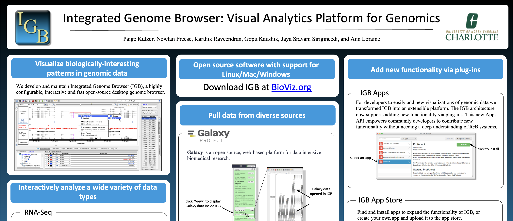
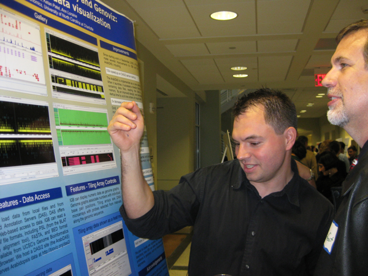

# IGB NEWS

### June 11, 2024: Virtual Workshop - Plant Biology 2024

We recently presented a virtual workshop demonstrating how researchers can use the Integrated Genome Browser to load 
RNA-Seq alignment data, visualize mutations and gene expression differences, and save reproducible, high-quality images 
for their next publication.

You can access the resources we used during this workshop as well as various practice materials by clicking on the 
following link and enrolling in our Canvas course: https://canvas.instructure.com/courses/9522993

* * *

### May 6, 2024: IGB 10.0.1 "bug fix" release

Today, we released version 10.0.1 of Integrated Genome Browser.

This new "bug fix" version of IGB fixes two major issues reported by the IGB community since the IGB 10.0.0 release:

* Users reported not being able to open "bigwig" format files with space characters either in the file name itself or in one or more folders contain the files. This is now fixed.
* We also fixed a problem with IGB's "color by" visual analytics feature. The heatmap editor was not launching when required. This is also now fixed.

* * *

### March 6, 2024: IGB 10.0.0 Released

Today, we released version 10.0.0 of Integrated Genome Browser.

This new release included several new features (see below), but by far
the most significant aspect of this new version of IGB is probably
going to be invisible to most IGB users.

This new version of IGB uses the most up-to-date, stable version of
the Java language - JDK 21. In addition to updating the Java that IGB
uses, we also updated nearly every third-party library IGB is using.

Thanks to these updates, you may notice some subtle improvements in
your experience using IGB - such as faster data loading and more efficient
use of computer memory. 

##### New Features and Improvements:

* IGB can now open and display data from CRAM files, a sequence alignment data format like BAM, but smaller. 
* Sequence pattern search in IGB's Advanced Search tab now handles nucleotide ambiguity codes (e.g., Y = C or T). This is especially useful when searching for possible recognition sites for transcriptional regulators.
* IGB now reports "block number" in tooltips and Selection Info tabbed panel for Annotation tracks. 
* We updated IGB's list of restriction enzymes and their recognition sites.
* Bug fixes: We corrected issues in which IGB or the IGB installer would crash or disappear

For a complete list of the new features and improvements, see <a href="https://wiki.bioviz.org/confluence/display/ITD/10.0.0">IGB 10.0.0 Release Notes</a>.

* * *

### February 22, 2024: NCRC Research Notes

We presented our work in poster format at the Research Notes (formerly
CHEM101) meeting on the North Carolina Research Campus (NCRC).

The poster showed how you can visually analyze RNA-Seq and ChIP-Seq
alignments and coverage graphs data in IGB. It also showed genomic
data stores IGB uses to retrieve data for visualization.

To see the poster, click the image below:

* * *

### November 3, 2022: <a href="./download.html">IGB 9.1.10</a> released

Today we released version 9.1.10 of Integrated Genome Browser.

For a list of new features and improvements, see <a href="https://wiki.bioviz.org/confluence/display/ITD/9.1.10">IGB 9.1.10 Release Notes</a>. 

* * *

### June 1, 2021: <a href="./download.html">IGB 9.1.8</a> released

Today we released version 9.1.8 of Integrated Genome Browser.

For a list of new features and improvements, see <a href="https://wiki.bioviz.org/confluence/display/ITD/9.1.8">IGB 9.1.8 Release Notes</a>. 

* * *

### Dec. 3, 2020: <a href="./download.html">IGB 9.1.6</a> released

Today we released version 9.1.6 of Integrated Genome Browser.

To review the new features and improvements available in this new version of 
IGB, visit the <a href="https://wiki.bioviz.org/confluence/display/ITD/9.1.6">IGB 9.1.6 Release Notes</a>. 

* * *

### May 29, 2020: <a href="./genome-dashboard">IGB Genomes Dashboard</a>

To make it easier for IGB users to find and load genome versions, we created <a href="./genome-dashboard">IGB Genomes</a>, which shows you every species and
genome assembly version available to load into IGB.

UNC Charlotte graduate students Sameer Shanbhag (CS MS) and later Philip Badzuh
(Bioinformatics PhD) developed the site.

Links:

* <a href="https://bitbucket.org/lorainelab/genome-dashboard">Source code</a>

* * *

### May 16, 2020: BioViz <em>Connect</em> <a href="https://www.biorxiv.org/content/10.1101/2020.05.15.098533v1.article-info">paper on BioRxiv</a>

Today we uploaded and released <a href="https://www.biorxiv.org/content/10.1101/2020.05.15.098533v1.article-info">a
new article</a> describing <a href="./connect.html">BioViz
<em>Connect</em></a>, a service that lets IGB users visualize their
data stored in CyVerse, a free cloud service for life scientists.

Congratulations to Loraine Lab graduate students Karthik Raveendran,
Chaitanya Kintali, Srishti Tiwari, and Pawan Bole whose work on <a
href="./connect.html">BioViz <em>Connect</em></a> is featured in this
paper.

* * *

### May 1, 2020: BioViz <em>Connect</em> released

<a href="./connect.html">BioViz <em>Connect</em></a> is a new add-on
for our Web site that lets you use Integrated Genome Browser to
visually analyse data stored in your CyVerse cloud account.

Previously, we called this site CyVerse Data, but later we changed the name to
<em>Connect</em>, since it literally connects IGB with CyVerse.

To see it in action, check out <a href="https://www.youtube.com/watch?v=okbsr4XYgn4">this video</a> by Dr. Nowlan Freese, BioViz <em>Connect</em> project manager.

#### FAQ
* **What can I do with BioViz <em>Connect</em>?** View your CyVerse Discovery Environment in an all new dashboard-style application. Stream data to IGB for visualization or use cloud computing to create all new visualizations. Add IGB specific annotations such as genome version and track color to control how data will look once loaded in IGB. Create public links to share and collaborate.

* **What is BioViz <em>Connect</em>?** BioViz <em>Connect</em> is an all new web application created by the BioViz team for annotating, analyzing and visualizing CyVerse Discovery Environment data in IGB.

* **What is CyVerse?** CyVerse is funded by the National Science Foundation with a mission to design, deploy, and expand national Cyberinfrastructure for Life Sciences research.

* **What is the Discovery Environment?** The Discovery Environment provides a web interface for cloud based computing and data storage.

* **How do I log in to BioViz <em>Connect</em>?** Use your CyVerse Discovery Environment credentials to <a href="https://www.bioviz.org/connect.html">log in</a>.

* **How do I get a CyVerse Discovery Environment account?** Create a free <a href="https://user.cyverse.org/register">CyVerse Discovery Environment account</a>.

* **How does BioViz <em>Connect</em> work?** BioViz <em>Connect</em> uses the CyVerse Terrain APIs to retrieve data, add annotations, and analyze data.

* **Where can I find the source code?** <a href="https://bitbucket.org/lorainelab/bioviz-connect">Source code</a> is available on BitBucket.

* * *

### April 6, 2020: <a href="./download.html">IGB 9.1.4</a> released

This release improves on how IGB communicates with the <a href="https://apps.bioviz.org">App Store for IGB</a>.

Many thanks are due to UNC Charlotte graduate student developers
Sameer Shanbhag, Noor Zahara, Pooja Nikhare, and Shamika Kulkarne
along with Alex Sullivan (University of Toronto) for their efforts to
identify, implement, and test the required improvements.

This release also includes changes to IGB's bookmarks REST API to
allow IGB to communicate with <a href="https://cyverse.org">CyVerse
cloud resources</a> via the soon-to-be-released BioViz Connect Web
site. Many thanks are due to Dr. Nowlan Freese and UNC Charlotte
graduate students Chaitanya Kintali and Karthik Raveendran for their
work on BioViz Connect.

Lastly, this release contains improvements to IGB's BAI file parsing
code, developed by Sai Charan Reddy Vallapureddy and Pawan Bole in
collaboration with Dr. Nowlan Freese.

* * *

### Jan. 9, 2020: <a href="./download.html">IGB 9.1.2</a> (bug fix) released

This release fixes an error that occurred when opening bigwig format
files on some Windows computers. This problem did **not** affect IGB
version 9.0.2.

The IGB team is grateful to IGB community members who reported the
error.  You have saved a lot of time and effort for many people by
alerting us to this problem!

We are especially grateful to Nadya Fursova and colleagues in the
[Klose Lab](http://kloselab.co.uk/) at the University of Oxford who
played a key role in fixing the error by sharing error messages,
answering follow-up questions about the problem, and then testing the
IGB 9.1.2 release candidate.

To get the new version, download the latest installer. Also, if you
run IGB version 9.1.0 or earlier, you will see a message inviting you
to upgrade to this new version.

* * *

### Dec. 9, 2019: <a href="./download.html">IGB 9.1.0</a> released!

IGB 9.1.0 is now available for download!

#### New features and improvements: ####

* **Visualize soft-clipped alignment regions.** IGB now makes it much easier to notice when alignments have "soft-clipped" regions on the ends of the alignment. Soft-clip visualizations can make it much easier to notice re-arrangments or other structural variations. They can also show when adapter sequences have not been well-trimmed prior to alignment. As with everything else in IGB, you can also customize how soft-clipped regions appear. And, of course, they are clickable, making it easy to copy soft-clipped sequences into other tools for further analysis. Check out the user's guide for more details.
* **New genome versions.** New genomes added to the IGB Quickload data sharing system include _Daphnia magna_ (Jan 2019, Apr 2010), _Daphnia pulex_ (Sep 2016, Feb 2011), _Anguilla rostrata_ (Oct 2016), and _Caenorhabditis elegans_ (Feb 2013) genomes. If you would like more to be added, just let us know!
* **Better feedback when things go wrong.** We improved the error and alert messages you see when IGB can't read your files for some reason. We hope this will help you figure out the problem yourself or gives us information that will help us solve the problems for you.
* **Info for Data Sources.** We added a new "info" button to the Data Sources table (in IGB Preferences) to help you manage and understand Quickload sites you may be adding to IGB.
* **Easier to open files.** We added new capability to open and view files in IGB without your first having to select a genome.
* **Fixed file parsing errors.** We fixed some errors in how IGB opens and reads alignment files in BAM (binary alignment) format. Now, IGB does a better job of reading those files and displaying alignments.
* **Better versioning transparency.** Now, when you run IGB, you can select **Help > About IGB** to find out which particular IGB version (called "commit hash") you are running. This is mainly a convenience for developers working with the IGB platform.
* **IGB App Store.** Starting with IGB 9.1.0, we have added an all-new <a href="https://apps.bioviz.org">IGB App Store</a> to the list of IGB App repositories. The App Store will be a place for App developers to upload and share their IGB extensions - called "Apps" - with the larger community.

For more info about IGB 9.1.0, please see IGB 9.1.0 Release Documentation.

* * *

### Nov. 26, 2018: IGB 9.0.2 released

IGB 9.0.2 is now available for download.

This minor release mainly corrects errors reported by users and updates external libraries IGB is using. In addition, we added new Quickload data sources, along with new backup mirror sites for core data sets.

#### Improvements include: ####

* The IGB installers are updated to fix some security errors that occurred when installing on MacOS Mojave. Thank you to everyone who reported this!
* We added new backup Quickload sites for the RNA-Seq, ChIP-Seq, and DNA-Seq data sources.
* New genomes are available for rat, mouse, and potato.
* IGB now supports newer VCF versions.
* We improved how IGB loads data from Quickload sites using position bookmarks.
* IGB is now using the latest build of Java 1.8 and up-to-date BAM and tabix parsing code from the htsjdk project.

* * *

### July 5, 2018: IGB 9.0.1 released

A new version of IGB is available that fixes some errors present in
9.0.0 and introduces new features.

#### New features and improvements: ####

* IGB now allows decimal values in "Filter by Score" filtering functions for BAM, BED, etc (annotation) tracks  ([IGBF-1204](https://jira.bioviz.org/browse/IGBF-1204))
* We improved aspects of IGB's heatmap-related features. We added a new heatmap color pallette fine-tuned for bisulfite sequencing data. ([IGBF-1205](https://jira.bioviz.org/browse/IGBF-1205)) Also new in IGB 9.0.1: heatmap settings for tracks will now persist between sessions. ([IGBF-1126](https://jira.bioviz.org/browse/IGBF-1126))
* Working with the [Renaissance Computing Institute](http://renci.org/) and the and the [SciDas.org project](http://scidas.org/), we added new data delivery Quickload sites to take advantage of top-speed data transfers provided by RENCI for users. ([IGBF-1200](https://jira.bioviz.org/browse/IGBF-1200))
* We also worked with the [Bio-Analytic Resource](http://bar.utoronto.ca) to add "View in IGB" links to BAR Web pages to IGB, similar to how Galaxy users can flow and view their data into IGB. You can also browse BAR RNA-Seq data sets in IGB thanks to a new Quickload site, which is hosted on RENCI but flows data from Amazon S3 ([IGBF-1218](https://jira.bioviz.org/browse/IGBF-1218))
* We fixed a number of errors in IGB, such as a bug in how IGB displays data from Oxford Nanopore long read sequences ([IGBF-1173](https://jira.bioviz.org/browse/IGBF-1173)), an error in running NCBI Blast from IGB ([IGBF-1154](https://jira.bioviz.org/browse/IGBF-1154)), and several more.

For the full list with links to detailed notes and more, see IGB 9.0.1 Release Documentation.

#### Other Highlights: ####

Behind the scenes, we improved our software development workflow, making it more open and transparent for continuing and potential contributors. Now, we label every issue with a tag indicating level of difficulty, so that students and project newcomers will have a way to get started as a contributors. We also organize two levels of code review, which helps us all learn the code better while also protecting against accidental introduction of bugs. Thanks to code review, we also learn more about each other's problem-solving techniques, which makes us better coders. (One of the best ways to improve your coding skills is to study how other coders write code and solve problems!)

In the spirit of all of us getting better at writing code, we developed a free, on-line course called [Open source programming with IGB](https://canvas.instructure.com/courses/1164217) using the open (and free!) Canvas platform. Some IGB graduate students have added some new case studies describing bugs and features they fixed or added.

Last but not least, we switched from using Jenkins to Bitbucket pipelines to build IGB. Now, whenever one of the team pushs a new branch, the pipeline automatically builds a fresh IGB installer and copies it to their fork's Downloads section. (This requires some specialized setup - if you want to try it, get in touch.) Thanks to this, we can very quickly release custom versions of IGB on demand for users who request it. This could be a great way for a research team (or company?) to distribute custom versions of IGB with their own Quickload sites already pre-configured, for example.

As always, if you have questions or comments, please get in touch!

* * *

### June 7, 2016: IGB-fx prototype available

The IGB team is built a new version of IGB that uses JavaFX
and 100% modular, services-based programming with OSGi.
A prototype version for developers is available from the
[IGB-fx source code repository](https://bitbucket.org/lorainelab/igb-fx).

We're built this new version of IGB from the ground up, focusing
on transforming IGB into a platform even beginning programmers can
use to create stunning new visualizations for new types of genomic data.

* * *

### June 6, 2016: IGB 9.0.0 released

Today we released IGB 9.0.0, a major version release that includes API improvements, performance improvements, and bug fixes.

* New Menu API (see developers guide)
* Better support for narrowPeak files - from ChIP-Seq experiments ([IGBF-1115](https://jira.bioviz.org/browse/IGBF-1115))
* Performance improvements when working with large Quickload sites ([IGBF-1114](https://jira.bioviz.org/browse/IGBF-1114))
* Fixing caching error when IGB closes during download ([IGBF-1110](https://jira.bioviz.org/browse/IGBF-1110))
* Fixing exception when sorting the Size column in the Cache tab ([IGBF-1111](https://jira.bioviz.org/browse/IGBF-1111))

* * *
### April 2016 - Two new IGB papers published

The journal Bioinformatics has published two new papers on IGB and IGB Apps:

* Freese NH, Norris DC, Loraine AE. Integrated genome browser: visual analytics platform for genomics. Bioinformatics. 2016 Mar 16. pii: btw069. [Read Article](http://www.ncbi.nlm.nih.gov/pubmed/27153568)

* Mall T, Eckstein J, Norris D, Vora H, Freese NH, Loraine AE. ProtAnnot: an App for Integrated Genome Browser to display how alternative splicing and transcription affect proteins. Bioinformatics. 2016 Apr 7. pii: btw068. [Read Article](http://www.ncbi.nlm.nih.gov/pubmed/27153567)

* * *
### March 31, 2016: IGB 8.5.4 released

Today we released IGB 8.5.4, a minor release that includes only cosmetic changes

* App Manager Menu Item added ([IGBF-1104](https://jira.bioviz.org/browse/IGBF-1104))
* Reorder welcome screen species ([IGBF-1105](https://jira.bioviz.org/browse/IGBF-1105))

* * *

### March 18, 2016: IGB 8.5.3 released

Today we released IGB 8.5.3, a minor release that includes a few minor bug fixes

* Adding Synonym File removes Data Sources Tab ([IGBF-1077](https://jira.bioviz.org/browse/IGBF-1077))
* "i" button should not be shown if optional url attribute not present ([IGBF-1068](https://jira.bioviz.org/browse/IGBF-1068))
* Opening a file by dragging-and-dropping causes freezing on Mac ([IGBF-1079](https://jira.bioviz.org/browse/IGBF-1079))
* Find Junctions Only Counting Single-mapping reads ([IGBF-1031](https://jira.bioviz.org/browse/IGBF-1031))
* VCF parsing error when average quality is empty string ([IGBF-1101](https://jira.bioviz.org/browse/IGBF-1101))

* * *

### January 20, 2016: IGB paper accepted for publication

It's official: Bioinformatics has accepted our revised manuscript describing the latest version of IGB.

To see a preprint of this paper and also the ProtAnnot paper, which was accepted for publication last month, see:

* Integrated Genome Browser: visual analytics platform for genomics - <a href="http://biorxiv.org/content/early/2015/09/08/026351">Preprint</a>
* ProtAnnot: an App for Integrated Genome Browser to display how alternative splicing and transcription affect proteins - <a href="http://biorxiv.org/content/early/2015/11/26/025924">Preprint</a>

* * *

### January 8-13, 2016: IGB and ProtAnnot at Plant Animal Genome Conference

Ann and Nowlan are giving several presentations on IGB and ProtAnnot during the 2016 Plant Animal Genome Conference in San Diego, including:

* A talk introducing ProtAnnot (Ann) during the <a href="https://pag.confex.com/pag/xxiv/meetingapp.cgi/Session/3052">Arabidopsis Information Portal</a> workshop - <a href="http://www.slideshare.net/AnnLoraine/introducing-protannot-araport-workshop-at-pag-2016">slides on Slideshare</a>
* Live demos of IGB and ProtAnnot (Ann and Nowlan) during the <a href="https://pag.confex.com/pag/xxiv/meetingapp.cgi/Session/3271">Wed afternoon Computer Demo</a> session
* A talk on the blueberry genome featuring IGB (Ann) during the <a href="https://pag.confex.com/pag/xxiv/meetingapp.cgi/Session/3094">Fruits and Nuts</a> session - <a href="http://www.slideshare.net/AnnLoraine/rnaseq-analysis-of-blueberry-fruit-development-and-ripening">slides on Slideshare</a>

We'll post links to slides and videos as soon as they're available.

* * *

### December 21, 2015: IGB 8.5.2 released

Today we released IGB 8.5.2, a minor release that includes several bug fixes and a few small new features.

* Disable ability to store empty passwords on dataproviders  ([IGBF-1060](https://jira.bioviz.org/browse/IGBF-1060))
* Improve error handling around data provider credentials ([IGBF-1051](https://jira.bioviz.org/browse/IGBF-1051))
* Clearing data set fails when refreshing QL server on genomes with many contigs ([IGBF-1061](https://jira.bioviz.org/browse/IGBF-1061))
* Symloaders not handling non-bed formats properly ([IGBF-1059](https://jira.bioviz.org/browse/IGBF-1059))
* Insertion glyph not shown correctly ([IGBF-1057](https://jira.bioviz.org/browse/IGBF-1057))
* Protannot paxml not recalled correctly ([IGBF-1001](https://jira.bioviz.org/browse/IGBF-1001))
* Do not allow user to set Max Cache size lower than the current cache size ([IGBF-1019](https://jira.bioviz.org/browse/IGBF-1019))
* Exception generated when trying to install an updatable plugin ([IGBF-1043](https://jira.bioviz.org/browse/IGBF-1043))
* Exception generated when trying to install an updatable plugin ([IGBF-1018](https://jira.bioviz.org/browse/IGBF-1018))
* Race condition vulnerability in bottom tabholder ([IGBF-1056](https://jira.bioviz.org/browse/IGBF-1056))

* * *
### November 30, 2015: IGB 8.5.1 released

Today we released IGB 8.5.1, a minor release that includes a single bug fix.

* Remote Wig File loading fails ([IGBF-1046](https://jira.bioviz.org/browse/IGBF-1046))

* * *
### November 20, 2015: IGB 8.5.0 released

Today we released IGB 8.5.0, a major release that includes many new features and improvements.

* Introduced support for narrowPeak and broadPeak file formats ([IGBF-1005](https://jira.bioviz.org/browse/IGBF-1005))
* Introduced a new caching system to improve performance and speed up data access of commonly accessed files ([IGBF-442](https://jira.bioviz.org/browse/IGBF-442))
* Introduced a App Manager created with JavaFx ([IGBF-959](https://jira.bioviz.org/browse/IGBF-959))

* Added a bundled JRE for the linux distribution ([IGBF-1000](https://jira.bioviz.org/browse/IGBF-1000))
* Added support for a new index attribute to the quickload annots.xml file tag ([IGBF-445](https://jira.bioviz.org/browse/IGBF-445))
* Improved error handling of broken quickload servers ([IGBF-808](https://jira.bioviz.org/browse/IGBF-808))
* Introduced support for unsorted bed files ([IGBF-1020](https://jira.bioviz.org/browse/IGBF-1020))
* Enable javafx file chooser in custom genome dialog ([IGBF-795](https://jira.bioviz.org/browse/IGBF-795))
* Make the "Save Password" checkbox checked by default ([IGBF-802](https://jira.bioviz.org/browse/IGBF-802))
* Implement weight for items under Tools menu ([IGBF-841](https://jira.bioviz.org/browse/IGBF-841))
* Refactor image export service to support plugins ([IGBF-974](https://jira.bioviz.org/browse/IGBF-974))

* * *
### September 15, 2015: New IGB paper

A new paper describing IGB is available as [a preprint on BioRXiv.org](http://bit.ly/1KQEfga). Highlights include all new visual analytics tools for high throughput
sequence data and the ability to add new features as IGB Apps (plug-ins), such as [ProtAnnot](http://bit.ly/1M9DQ5X).

* * *
### September 11, 2015: ProtAnnot plug-in for IGB

The IGB team released a new IGB App called ProtAnnot, which shows
protein motifs and annotations in the context of genomic
sequence. Using ProtAnnot, you can search Interpro for conserved
motifs and better understand gene function. You can read more about it
in the [ProtAnnot](http://bit.ly/1M9DQ5X) pre-print.

* * *
### September 8, 2015: IGB 8.4.4 released

Today we released IGB 8.4.4, a minor release that includes a patch for performance degrading while zooming into very large gene models with annotation labels set to "none".

* High level zoom on large genes is causing lag if label set to "none"  ([IGBF-933](https://jira.bioviz.org/browse/IGBF-933))

* * *
### September 2, 2015: IGB 8.4.3 released

Today we released IGB 8.4.3, a minor release that includes a few enhancements to existing features, and patches for defects.
A noteworthy patch is included for a serious bug in Ubuntu which causes the JVM to crash whenever a file chooser widget was presented for loading local files.
We have reverted to using a non-native file chooser on Ubuntu as a workaround.

* IGB returns to default chromosome after removing any track. (local files only)  ([IGBF-915](https://jira.bioviz.org/browse/IGBF-915))
* Remove checkboxes from bottom of plug-ins tab ([IGBF-914](https://jira.bioviz.org/browse/IGBF-914))
* Bookmark module activation fails if menu depth exceeds 4 levels ([IGBF-903](https://jira.bioviz.org/browse/IGBF-903))
* UriUtils does not properly handling http 500 response if initial validation returns 200 ([IGBF-902](https://jira.bioviz.org/browse/IGBF-902))
* "Customize..." action should open to the "Tracks" tab in Preferences ([IGBF-882](https://jira.bioviz.org/browse/IGBF-882))
* Restore JFileChooser and revert use of AWT FileDialog for Ubuntu ([IGBF-872](https://jira.bioviz.org/browse/IGBF-872))
* Allow .svg export always, even Whole Frame ([IGBF-779](https://jira.bioviz.org/browse/IGBF-779))

* * *
### August 10, 2015: IGB 8.4.2 released

Today we released IGB 8.4.2, a minor release which includes a variety of small bug fixes and user experience improvements.  This release also introduces a new plugin to our "Optional" plugins repository: the *ProtAnnot* plugin.  This plugin integrates a viewer which is designed to make it easy to see how alternative mRNA structures affect the various protein products encoded at a locus. We will be releasing a video tutorial soon to demonstrate the functionality of this new plugin.

* Improve user feedback when adding broken quickload sites ([IGBF-808](https://jira.bioviz.org/browse/IGBF-808))
* Local species.txt is parsed incorrectly ([IGBF-796](https://jira.bioviz.org/browse/IGBF-796))
* Spaces getting converted to "%20" in Data Sources table ([IGBF-748](https://jira.bioviz.org/browse/IGBF-748))
* Editing URL of secured quickoad sites causes strange behavior in IGB including the inability to remove a data source ([IGBF-868](https://jira.bioviz.org/browse/IGBF-868))
* Not selecting "Save Password" checkbox when adding two secured Quickoad sites causes too many popups to appear during a session ([IGBF-866](https://jira.bioviz.org/browse/IGBF-866))
* Working with multiple secure quickload sites causes authentication popup to trigger unexpectedly ([IGBF-840](https://jira.bioviz.org/browse/IGBF-840))

* * *

### July 25, 2015: MI bundle plug-in for IGB

Dr. Arnaud Céol from the Center for Genomic Science at the Italian Institute of Technology published a paper on the MI bundle, an IGB plug-in
for mapping and visualizing genomic regions in molecular interactions structures. This plug-in allows researchers to identify potential functional
impacts caused by mutations. The paper can be found at [http://bit.ly/1MpYkKH] (http://bit.ly/1MpYkKH), and more information at [http://cru.genomics.iit.it/igbmibundle/] (http://cru.genomics.iit.it/igbmibundle/).

* * *

### July 8, 2015: IGB 8.4.1 released

Today we released IGB 8.4.1, a minor release which resolves one significant regression in the IGB 8.4.0 release related to failing to properly preserve the track order.
We have also included a few more minor improvements with this release.

*   Track Order is reverting to load order on chromosome change ([IGBF-793](https://jira.bioviz.org/browse/IGBF-793))
*   The wrong column in species.txt used for species combobox ([IGBF-789](https://jira.bioviz.org/browse/IGBF-789))
*   It's not possible to edit QL URL when it's "not responding" ([IGBF-788](https://jira.bioviz.org/browse/IGBF-788))
*   It is possible to incorrectly persist a dataprovider's preference node ([IGBF-790](https://jira.bioviz.org/browse/IGBF-790))

* * *
### July 6, 2015: IGB 8.4.0 released

Today we released IGB 8.4.0, a major release which includes several significant software architectural improvements.
The improvements included in this release have mostly been aimed at enhancing the APIs exposed to plugin developers
and making our code base more developer friendly; however, the release also contains many usability improvements
and bug fixes.

*   DataProvider API introduced as a full replacement for SeverTypeI ([IGBF-663](https://jira.bioviz.org/browse/IGBF-663))
*   IGB Quickload rewritten as a DataProvider implementation ([IGBF-783](https://jira.bioviz.org/browse/IGBF-783))
*   Das rewritten as a DataProvider implementation ([IGBF-578](https://jira.bioviz.org/browse/IGBF-578))
*   Das2 support restored as a DataProvider implementation ([IGBF-579](https://jira.bioviz.org/browse/IGBF-579))
*   Fix for bug in the fasta parser ([IGBF-540](https://jira.bioviz.org/browse/IGBF-540))
*   Annotation Font Label Options panel added to allow user to control the behavior of font label rendering ([IGBF-784](https://jira.bioviz.org/browse/IGBF-784))
*   Export Image widget has been updated and several small bugs were resolved ([IGBF-719](https://jira.bioviz.org/browse/IGBF-719), [IGBF-755](https://jira.bioviz.org/browse/IGBF-755), [IGBF-719](https://jira.bioviz.org/browse/IGBF-719))
*   IGB developer's guide updated to include examples of how to get started developing IGB plugins (Developer's Guide)

* * *
### May 12, 2015: IGB 8.3.4 released

Today we released IGB 8.3.4, a minor release which includes bug fixes and some improvements:

*   Graph Track Operations Usability Enhancements ([IGBF-635](https://jira.bioviz.org/browse/IGBF-635))
*   Remove parameter input option for what should be hardcoded Track "Operators" ([IGBF-393](https://jira.bioviz.org/browse/IGBF-393))
*   Examine and fix the synonym error in the C. elegans genome ([IGBF-538](https://jira.bioviz.org/browse/IGBF-538))
*   Change the text in the MM8 genome from "March" to "Feb" ([IGBF-551](https://jira.bioviz.org/browse/IGBF-551))
*   Create a nested folder inside the IGB.zip distribution ([IGBF-583](https://jira.bioviz.org/browse/IGBF-583))
*   Fix "select" and "selectfeature" scripting commands, and update "loadmode" documentation to reflect actual options available ([IGBF-598](https://jira.bioviz.org/browse/IGBF-598))
*   Remove Track Operation text and punctuation in Graph tab ([IGBF-606](https://jira.bioviz.org/browse/IGBF-606))
*   Bed Symloader does not properly parse bedDetail type when the number of columns is less than 14 ([IGBF-619](https://jira.bioviz.org/browse/IGBF-619))
*   Remove Input parameter box for Sqrt Graph Track Operation ([IGBF-643](https://jira.bioviz.org/browse/IGBF-643))
*   Change minimum requirement for Residue Search to 1 character ([IGBF-644](https://jira.bioviz.org/browse/IGBF-644))
*   Subtract Track Operation Works Differently if Commas are used in the Value ([IGBF-648](https://jira.bioviz.org/browse/IGBF-648))
*   Selecting "Make Track" in the Graph Thresholds Dialogue generates an exception ([IGBF-610](https://jira.bioviz.org/browse/IGBF-610))

* * *
### May 6, 2015: IGB 8.3.3 released

Today we released IGB 8.3.3, a minor release which includes only a single bug fix:

*   Data Sources become duplicated when re-enabling server or refreshing server ([IGBF-498](https://jira.bioviz.org/browse/IGBF-498))

* * *
### March 30, 2015: IGB 8.3.2 released

Today we released IGB 8.3.2, a minor release which includes bug fixes and some improvements, such as:

*   Add support for other FASTA file extensions ([IGBF-414](https://jira.bioviz.org/browse/IGBF-414))
*   Open Custom Genome improvements ([IGBF-479](https://jira.bioviz.org/browse/IGBF-479))
*   Refactor and simplify Open File feature ([IGBF-377](https://jira.bioviz.org/browse/IGBF-377))
*   Update Bundled JRE to resolve intermittent crashes on Mac OS X ([IGBF-380](https://jira.bioviz.org/browse/IGBF-380))
*   Add "delete all tracks" IGB scripting command) ([IGBF-472](https://jira.bioviz.org/browse/IGBF-472))
*   Bed Parser Minor Improvements to resolve issues related to optional bin field ([IGBF-512](https://jira.bioviz.org/browse/IGBF-512))
*   GFF3 Tooltip duplicates removed ([IGBF-513](https://jira.bioviz.org/browse/IGBF-513))
*   Advanced Search Tab "Gene Name" column should be renamed to Title and mapped to correct property ([IGBF-514](https://jira.bioviz.org/browse/IGBF-514))

### February 23, 2015: IGB 8.3.1 released

Today we released IGB 8.3.1, a minor release which includes several bug fixes and small improvements

*   Added Customize option back to track label context menu ([IGBF-379](https://jira.bioviz.org/browse/IGBF-379))
*   Open File Diaolog modifications made for native look and feel ([IGBF-377](https://jira.bioviz.org/browse/IGBF-377))
*   Search indexing problem with GFF file format vs. BED-detail ([IGBF-23](https://jira.bioviz.org/browse/IGBF-23))
*   Moved igb-command-socket module into optional plugins ([IGBF-417](https://jira.bioviz.org/browse/IGBF-417))
*   Genome load mode doesn’t indicate loading has happened for chromosomes for which there was no data ([IGBF-378](https://jira.bioviz.org/browse/IGBF-378))
*   Set home as default location for Open File dialogs ([IGBF-405](https://jira.bioviz.org/browse/IGBF-405))
*   Nothing appears above Annotations when labeling by "Title" ([IGBF-387](https://jira.bioviz.org/browse/IGBF-387))

* * *

### January 22, 2015: IGB 8.3.0 released

Today we released IGB 8.3.0, a milestone major release for the IGB project introducing native platform installers for Windows, Mac, and Linux.  This release does not contain any new major features,
but does include many bug fixes.

*   Create Native Installers ([IGBF-347](https://jira.bioviz.org/browse/IGBF-347))
*   Improve current filter for paired data ([IGBF-326](https://jira.bioviz.org/browse/IGBF-326))
*   Dragging a file over an icon in the toolbar generates a NullPointerException ([IGBF-333](https://jira.bioviz.org/browse/IGBF-333))
*   Sliced View tab intron selection causing an error ([IGBF-351](https://jira.bioviz.org/browse/IGBF-351))
*   Ensembl External Viewer is Not Using Current Genome Version after URL change ([IGBF-354](https://jira.bioviz.org/browse/IGBF-354))
*   Remove "Accept Network Connections" popup when launching IGB on a Mac ([IGBF-358](https://jira.bioviz.org/browse/IGBF-358))
*   Right-clicking on track label when no data has been loaded generates an exception ([IGBF-346](https://jira.bioviz.org/browse/IGBF-346))
*   Fix and Organize Developer Plugins ([IGBF-352](https://jira.bioviz.org/browse/IGBF-352))
*   Fix NPE in Merge Annotation Operator Development Plugin ([IGBF-361](https://jira.bioviz.org/browse/IGBF-361))
*   Tooltips are not displaying on Windows;generates a "BadLocationException" ([IGBF-336](https://jira.bioviz.org/browse/IGBF-336))
*   Bottom of tooltips box may be cutoff ([IGBF-304](https://jira.bioviz.org/browse/IGBF-304))
*   Put "cigar", "mapq", and "id" in all caps in tooltips/selection info ([IGBF-330](https://jira.bioviz.org/browse/IGBF-330))
*   Typing zero into Export Image size parameter box causes annoying question mark to appear ([IGBF-252](https://jira.bioviz.org/browse/IGBF-252))
*   Remove "Do you want to run script" dialog ([IGBF-273](https://jira.bioviz.org/browse/IGBF-273))
*   Hovering across gene models in HG16 prints harmless stacktrace, which should be a warning or silenced ([IGBF-355](https://jira.bioviz.org/browse/IGBF-355))
*   Selecting the "Axis" option while Selecting Tracks under the Edit menu generates a null pointer exception ([IGBF-357](https://jira.bioviz.org/browse/IGBF-357))

* * *

### January 8, 2015: Native Installers coming very soon for IGB

We are planning to release native installers for Windows/Mac/Linux very soon and drop Java Web Start, stay tuned for this upcoming release!

* * *

### January 8, 2015: IGB 8.2.3 released

Today we released IGB 8.2.3 which resolves a small bug with IGB's cache system.

*   File name too long IOException from igbquickload server ([IGBF-342](https://jira.bioviz.org/browse/IGBF-342))

* * *

### January 7, 2015: IGB 8.2.2 released

Today we released IGB 8.2.2.  This release includes resolutions for the following issues:

*   Fix startup bug affecting users running IGB from bash script ([IGBF-341](https://jira.bioviz.org/browse/IGBF-341))

* * *

### December 18, 2014: IGB 8.2.1 released

Today we released IGB 8.2.1.  This release included resolutions for the following issues:

*   Bam Flag Interpreter does not properly handle combinations of flag values ([IGBF-321](https://jira.bioviz.org/browse/IGBF-321))
*   Misleading message after opening a Custom Genome ([IGBF-306](https://jira.bioviz.org/browse/IGBF-306))
*   Reorganize the tooltip info for Paired-End data ([IGBF-327](https://jira.bioviz.org/browse/IGBF-327))
*   Prevent "zoom in to see your data" popup when loading reference sequence ([IGBF-318](https://jira.bioviz.org/browse/IGBF-318))
*   "Copy Bookmark URL" under the Bookmarks menu does not copy the URL for the selected bookmark ([IGBF-311](https://jira.bioviz.org/browse/IGBF-311))
*   Disable "+/-" checkbox under the Annotation tab when "Show as Paired" is enabled ([IGBF-320](https://jira.bioviz.org/browse/IGBF-320))

* * *

### December 15, 2014: IGB 8.2 released

The IGB development team is pleased to announce the immediate availability of the new IGB 8.2 major release. This release contains resolutions to over 200 issues, including many bug fixes and new features.
Major New Features:

*    Paired End Visualization for NGS data
*    Addition of the latest fruit fly genome

Usability Improvement Highlights:

*    New tooltips
*    New Right Click Context Menu available in track "whitespace"
*    Right-click menu re-organization (easier to find stuff)
*    Improved custom genome loading widget
*    Improved Image Export widgets

Power User Highlights:

*    New feature available for controlling IGB from R (Sample code available at https://bitbucket.org/lorainelab/rtoigb)

Engineering Notes:

*    Migration of build system from ant to maven with many significant improvements for developers
*    *    Maven is more natural fit for our modular osgi project and having a plugin archetype reduces the technical burden to community contributors
*    *    OSGI manifest files no longer need to be manually managed since the maven bundle plugin leverages a projects declared dependencies and classpath to populate the manifest
*    *    project dependencies are formalized and versions are now tracked (a major improvement over a set of jars in a lib directory)
*    *    hosted maven repository contains project artifacts
*    Upgraded internal logging system to use standard slf4j api (with logback implementation)
*    *    SLF4j is a powerful api which greatly improves on java.util.logging and will improve our code quality and help reduce the time it takes to debug complex issues
*    Fixed External Contributor Plugin Repository System
*    *    This is a repository which makes available plugins which are not turned on by default in IGB. These plugins are not on by default either because they are not yet stable enough to be a part of the core project or because they add functionality not needed by the majority of our users. Restoring our projects ability to support community plugins was an important development priority for us while preparing IGB 8.2.

* * *

### December 8, 2014: IGB 8.1.13 released

In preparation for our upcoming IGB 8.2 release, we have released a minor release with some minor bug fixes to our update notification system. With this notification system we will be able to notify users when we release IGB 8.2. This is important, because major releases cannot be pushed out silently, and require users to download a fresh copy of our software.

*    Patch bug in Notification System so it can be leveraged to notify user's of IGB 8.2 release (IGBF-282)

* * *

###  December 1, 2014: Updated JNLP Generator Service Released

In preparation for our upcoming IGB 8.2 release, we have released an updated and simplified jnlp generator web service. For more information, see: JNLP Generator Service

* * *

###  November 25, 2014: IGB 8.1.12 Released

We have released a minor patch to ensure our blast functionality is not impacted by an upcoming NCBI blast URL change, For more information, see:

*   NCBI BLAST url is changing on Dec. 1, 2014 (IGBF-267)

* * *

### September 10, 2014: IGB 8.1.11 Released

The IGB team is pleased to announce a new release of IGB. This new version fixes an error in SVG image export. Thank you to everyone who reported it. This new release also fixes BLAST search on gene models. Last but not least, we've modified our backup QuickLoad server code. Now, if the main IGBQuickLoad.org site is unavailable, IGB will automatically switch over to our mirror site. For more information on these changes and why we needed them, see:

*   Mirror site failover (IGBF-141)
*   BLAST search fix (IGBF-186)
*   SVG export functionality (IGBF-185)

* * *

### Sept 2, 2014: Welcome aboard Nowlan Freese

Today we welcome Nowlan Freese, Ph.D., who joins the IGB team as a postdoctoral trainee. Nowlan will help us reach out to new users and also help existing users get greater value from IGB. Nowlan studied developmental biology as a graduate student at Clemson University and most recently did postdoctoral work at the Max Planck Institute. During his postdoc, Nowlan plans to build expertise in bioinformatics data analysis, using IGB and other tools.

* * *

### July 30, 2014: IGB 8.1.10 Released

Today we released IGB 8.1.10, a minor release which includes a patch for the following bug

*   IGB will no longer launch using Java Web Start on Windows 7/8 platform after release of latest Java version (IGBF-136)

* * *

### July 30, 2014: Notice: Windows 7/8 Java Webstart Bug introduced with Java 7 update 65 and Java 8 update 11

We have been able to confirm the latest releases of Java 7 and Java 8 have introduced a windows specific Java Web Start bug which is unfortunately currently impacting our users. This new bug impacts all past web start releases of IGB. We have submitted a bug report to Oracle, but will be releasing a workaround later today to resolve this issue for our users.

For more details on the bug see our Jira Issue (IGBF-136)

* * *

### July 21, 2014: IGB 8.1.9 Released

Today we released IGB 8.1.9, a minor release which includes a patch for the following

*   Typo in View menu entry for "Show Zoom Stripe" (IGBF-124)

* * *

### July 08, 2014: IGB 8.1.8 Released

Today we released IGB 8.1.8, a minor release which includes a patch for the following bug

*   Adding local QuickLoad site fails (IGBF-95)

* * *

### June 16, 2014: IGB 8.1.7 Released

Today we released IGB 8.1.7, a minor release which includes a patch for the following bug

*   Unable to load gzipped wig files over https (IGBE-171)

* * *

### June 10, 2014: IGB 8.1.5 Released

Today we released IGB 8.1.5, a minor release which addresses many small bugs and improves stability. The list below highlights some of the improvements.

*   Starting IGB without an Internet connection no longer causes servers to be permanently disabled
*   Quickload mirror site failover has been restored
*   IGB Bookmarks embedded in a web page again return an http 204 response code
*   The image export widget has been enhanced to improve integration with Mac OS X

* * *

### May 30, 2014: IGB 8.1.4 Released

Today we released IGB 8.1.4, a minor release which a bug impacting the proper loading of BAM files from https locations

* * *

### May 29, 2014: IGB 8.1.3 Released

Today we released IGB 8.1.3, a minor release which resolves several bugs and enhances the look and feel of several widgets for MAC OSX users.

*   Fix for track name bug when bed files had the same trackline name information (IGBE-160)
*   Fix for annotation name black rectangle bug (IGBF-31)
*   Fix for read sequence rendering bug (IGBF-31)
*   Workaround for Safari caching Galaxy External View links bug addedIGBF-44

* * *

### April 16, 2014: IGB 8.1.2 Released

Today we released IGB 8.1.2, a minor release which resolves a critical bug

* * *

### April 15, 2014: IGB 8.1 Released

Today we released IGB 8.1, a major release which includes enhanced integration with Galaxy.

* * *

### March 19, 2014: IGB 8.0.4 Released

Today we released IGB 8.0.4, a minor release which retracts some functionality which was not meant to be included in the 8.0.3 release.

* * *

### March 18, 2014: IGB 8.0.3 Released

Today we released IGB 8.0.3, a minor release which includes a few bug fixes as well as added support for custom jnlp launch files. We have also added a new JNLP Generation Service to bioviz.org to help facilitate the generation of custom jnlp launch files.

* * *

### March 7, 2014: Dec 2013 human genome release (hg38) now supported in IGB

Today we add the latest human genome assembly (hg38) as H_sapiens_Dec_2013 to the IGB QuickLoad data repository. Now, when you visit the latest human genome by clicking the Mona Lisa image on the IGB start screen, the Dec. 2013 human genome assembly and RefGene annotations will automatically load. You can still view older versions by selecting them in the Current Genome tab. If you have questions, please feel free to get in touch! Send us a tweet or post a message on the IGB Discussion forum at SourceForge.

* * *

### March 3, 2014: IGB moved to git repository hosted at BitBucket.org

Today, after many years of using svn, we migrated the IGB source code to a new git repository hosted on BitBucket. Using a distributed version control system git will make it easier for developers to contribute new ideas and new features to the project. Thank you David for managing the transition.

* * *

### March 3, 2014: IGB 8.0.2 released

Today we released IGB 8.0.2, a minor release that corrects issues affecting heatmap graph style display, search, and bookmark exporting.

* * *

### Feb. 24, 2014: IGB team welcomes new lead developer David Norris

UNC Charlotte Computer Science graduate David Norris re-joined the team today, taking over from Hiral Vora as lead developer on the IGB project. In his previous position, David worked at Red Hat on multiple projects and gained valuable experience in many aspects of open source software development. In his new position, he looks forward to using his knowledge and skill to improve IGB functionality for users. Welcome to the team!

* * *

### Feb. 8, 2014: SR gene annotations updated for Arabidopsis TAIR10 genome

SR genes encode RNA-binding proteins that regulated and help to catalyze splicing. We've updated the gene symbols and descriptions for Arabidopsis SR genes so that IGB now follows the nomenclature recommendations from Barta et al (2010) Plant Cell. Code used to modify the annotation files is freely available from this repository at BitBucket.org.

* * *

### Feb. 6, 2014: Older human genomes supported in IGBQuickload.org

In response to user requests, we've added two archival human genome assemblies (hg17 and hg18) to the IGBQuickload site. This will enable you to view gene model (refGene) annotations with HUGO gene symbols for these older releases similar to the latest release.

* * *

### Jan. 3, 2014: Farewell Hiral

Today was Hiral's last day on the IGB team. After four years of great work, he is leaving for a new position at Deutsches Bank in the Research Triangle Park area. Thank you for your many outstanding efforts helping scientists get the most value from their data. Good luck in your new position!

* * *

### Dec. 18, 2013: DAS2 retired

Today we retired the DAS2 servers hosted on IGBQuickload.org and BioViz.org. We also retired the Affymetrix Arabidopsis tiling array data sets as well as Affymetrix microarray probe set visualizations for most genome versions. Note that IGB can still open Affymetrix "link.psl" files, and so if you need to visualize the probe sets, you can download the files from Affymetrix and open them in IGB.

* * *

### Dec. 17, 2013: Farewall Alyssa!

Today we say a sad "goodbye" to IGB Outreach and Testing Coordinator Alyssa Gulledge, who leaves us for a new opportunities in Atlanta. Thank you Alyssa for your many efforts and we wish you the best of luck. We will miss you!

* * *

### Dec. 6, 2013: IGB 8 released

This new version of IGB has many improvements, including:

*   Faster data loading. New optimizations enable gene models to load even faster from IGBQuickLoad servers.
*   Track filters. New track filters let you hide or show reads and other features based on attributes like splicing and score.
*   Color by score improved. IGB's new Cytoscape-inspired gradient color chooser lets you choose a range of colors to indicate scores. This is especially useful for analyzing ChIP-Seq results and output from programs like MACS.
*   Right-click blast searches. Now you can right-click a gene model or other features and search its protein or spliced nucleotide sequence against the NCBI nr protein database (inspired by Apollo)

* * *

### Oct. 30 - Nov. 2, 2013: IGB at Genome Informatics, CSHL

Ann presented a poster and gave demos introducing IGB 8 to attendees at the Cold Spring Harbor Genome Informatics Meeting. To test-run IGB 8, download and run IGB 8 preview.

* * *

### Oct. 29, 2013: Focus on a Feature - Introducing IGB 8

This month hosted two sessions of IGB Focus on a Feature to introduce new features of IGB 8, scheduled for release in December. To test-run IGB 8, download and run IGB 8 preview.

In this live tutorial, we showed how to:

*   Load your own custom genome into IGB
*   Load and filter RNA-Seq data
*   Color-code features by score
*   Run BLASTX searches at NCBI
*   And more...

Also see the Announcement on the BioStars message board.

* * *

### Sept. 25, 2013: Focus on a Feature - Working with Sequence Data

Alyssa Gulledge and Ann Loraine led an hour-long on-line Focus on a Feature webinar that introduced participants to some neat tricks you can do with the IGB Advanced Search tab, such as searching for transcription factor binding sites and mapping and visualizing PCR primer sequences. Ann started the webinar with a quick review of moving and zooming in IGB, and then Alyssa showed off the sequence manipulation and analysis features. Due to technical problems, we were only able to record Alyssa's part of the presentation. We'll post a video on the IGB YouTube channel as soon as we finish editing it. For a description of the webinar, see our announcement on the Biostars Web site.

* * *

### Sept. 9, 2013: IGB 7.0.4 released

Today a new bug fix release debuted on the Bioviz Web site. No new features were introduced, only corrections to existing features and optimizations to improve IGB performance and stability.

* * *

### Aug. 28, 2013: First Focus on a Feature - Graphs

To help IGB users get more out IGB, we've started a new monthly Focus on a Feature webinar to be held at 1:30 pm Eastern time on the last Wednesday of every month. The first Focus on a Feature event covered genome graphs and graph manipulations.

* * *

### July 22, 2013: IGB 7.0.3 released

A new bug fix release was released today. As always, this release contains no new features, just fixes for bugs reported by users or the IGB testing team.

* * *

### May 17, 2013: IGB Workshop at WiNGS

The IGB team led a hands-on workshop demonstrating how to use IGB at the Workshop in Next-Generation Sequencing and Metabolomics (WiNGS) held at the UNC Charlotte Center City campus on May 17. This two-hour workshop described using IGB to explore RNA-Seq data set from pollen, based on our article titled RNA-seq of Arabidopsis pollen uncovers novel transcription and alternative splicing. A step-by-step Web-based tutorial from the workshop is available.

* * *

### April 30, 2013: IGB 7.0.2 released

Today we released a new "bug fix" release of IGB. This releases introduces no new features, just fixes for bugs reported by users or the IGB testing team.

* * *

### April, 2013: New IGB QuickLoad site for pollen

A new IGB QuickLoad site for pollen-related data sets is now available at igbquickload.org/pollen. The inaugural data set on the site is a 75-base, single-end RNA-Seq dataset from Arabidopsis pollen and seedlings. An in-depth analysis of these data appears in RNA-Seq of Arabidopsis pollen uncovers novel transcription and alternative splicing, published on-line in the journal Plant Physiology.

* * *

### Feb. 11, 2013: IGB 7.0.1 released

A new minor release was released. This releases introduces no new features, just fixes for bugs reported by users or the IGB testing team. For the release announcement, visit this post on the GenoViz developers' list.

* * *

### January 28, 2013: IGB 7.0 released

A new major release of IGB is available for download. Some of the new features in IGB 7.0 include:

*   IGB sessions : You can now save and load IGB sessions, which helps you save your place in a long-term analysis or share your work with others.
*   Sequence viewer : The Sequence Viewer now supports saving and copying protein sequences.
*   Autoscroll : IGB autoscroll is now easier to configure, start, and stop, which helps in scanning large regions.
*   Better-looking, more informative gene models : Gene models now have optional intron arrow marks to show strand, and when you load the genomic sequence and zoom in, protein translations appear.
*   Annotation tab : A new Annotation tab makes configuring and styling annotation tracks much easier. Use the new operations menus to copy, summarize, and compare tracks.
*   Toolbar : A new configurable toolbar provides one-click access to the most useful IGB functions.
*   Stack and track height : New options for setting the height of tracks give you more control over the amount and size of data to be shown.
*   Better searching : Easier, faster searching helps you find genes by gene name or keyword.
*   Better color by score : You can now set the range of values to show under the color by score annotation setting.
*   Selection Info box : A new selection info box reports the name or number of annotations you've selected, making it easier to explore your data.
*   Countless internal improvements : The IGB developers added many improvements to the IGB code base, making IGB 7.0 the most robust IGB ever.

For more information, visit New in IGB 7.0.

* * *

### July 5, 2012: Fragaria vesca available in IGB QuickLoad

Fragaria vesca, also known as the woodland strawberry, is now supported at IGBQuickLoad.org as genome version F_vesca_Sep_2011. Currently, genomic sequence and gene predictions are available. We were able to add the data thanks to advice from Stephen Ficklin of the Main Lab at Washington State University. Note that the Main lab develops genome database resources for the rosaceae, also known as the rosids, including peach, apple, cherry as well as strawberry. For more information, visit GDR - Genome Database for Rosaceae.

* * *

### June 5, 2012: IGB 6.7.2 released

A new minor release of IGB is available. This new release fixes a couple of reported bugs and adds new features, including:

*   support for SVG image format output
*   an option to specify IGB bookmark server port (see this IGB forum post)

* * *

### June 5, 2012: Nematostella vectensis genome available in IGB QuickLoad

The IGB QuickLoad site now supports the Nematostella vectensis genome and annotations. We collected sequence data and annotations from Metazome, a database similar to
Phytozome that provides access to a variety of animal genomes. Data provided include sequence along with gene model annotations, with linkouts to Google and Metazome.

* * *

### May 17-18, 2012: IGB workshop at WiNGS

The IGB team at UNC Charlotte presented at the UNC Charlotte Bioinformatics and Genomics Department Workshop in Next-Generation Sequencing (WiNGS). On Thursday, Ann gave a talk describing IGB features and demonstrated using IGB to examine splice variants with RNA-Seq data. On Friday, she presented a two-hour interactive workshop on using IGB to view RNA-Seq data from Arabidopsis. Alyssa Gulledge helped organize the WiNGS workshop; she arranged practise talks for speakers, trained students, and helped keep things running smoothly. IGB slides and workshop materials are available for download:

*   Slides from IGB presentation
*   Workshop tutorial: Introducing IGB
*   Workshop tutorial: Novel Splicing

If you would like to use the tutorials or slides in teaching, please let us know. We would be happy to share the originals with you so that you can customize the tutorials for your students.

* * *

### April 13, 2012: Sorghum RNASeq data set added to IGBQuickload

We added a new RNAseq data set to the main IGBQuickLoad.org/quickload data site. The data are from an article titled Functional annotation of the transcriptome of Sorghum bicolor in response to osmotic stress and abscisic acid published in Oct., 2011.

These data include three replicates per sample type of sorghum root and shoot samples undergoing simulated drought stress and ABA treatments and their corresponding controls. This data set offers a unique look at the stress-regulated transcriptome of this highly drought-tolerant and hardy plant.

To deploy the data set, we downloaded the raw data files as .sra files, converted them to FASTQ format, and then aligned them onto the January 2009 release of the Sorghum bicolor genome using TopHat 1.3.3. We subdivided the alignments files into read alignments that mapped once (SM) or more than once (MM) onto the genome. We also generated tabix-indexed coverage (.bedgraph) and TopHat junction (.bed.gz) files for each sample.

To access the data in IGB, load the Sorghum bicolor genome Jan 2009. Open the folder named RNASeq. Data sets appear in subfolders SM (single- mapping), MM (multi-mapping), ALL (both multi- and single-mapping), and Juncs, junctions predicted by TopHat from spliced alignments.

* * *

### Feb 9, 2012: IGB 6.7 released

Today we released a new version of IGB, which contains many new features and improvements. Just of few of these include:

*   Improved Data Access Panel : We moved species and genome version selection menus to the Current Genome tab, opening up more space for data set display. We also added new ways to configure tracks via the Data Management Table (formerly called the Load Mode Table).
*   Take notes with bookmarks : We added the ability to associate notes with bookmarks. We also redesigned the Bookmarks tab and made it easier to sort, delete, and organize your bookmarks.
*   Better image export functions : You can now specify image resolution and size when you save images from IGB. The Image Export window now also shows you an image preview. We also added the ability to export images from the Genomic Sequence Viewer as well as the Main View and the Sliced View.
*   Better ways to display results from sequence searches : You can now overlay the results from multiple searches onto the genomic sequence, making it much easier to view PCR primer sequences, promoter motifs, and other items of interest in the same view.
*   New start screen : IGB now displays image shortcuts you can click to quickly go to your genome of interest.
*   Better data loading : When you access a file, a "blank" track appears letting you know that IGB recognized your file.

* * *

### Feb 6, 2012: New tutorials on working with RNA-Seq data available

Many users have asked us how to create files for visualization in IGB. This can be a daunting task, particularly when working with results from high-throughput sequenicng experiments.

To help users and the bioinformatics personnel who support their research, we have published two new tutorials describing how to use bioinformatics tools such as tophat, samtools, Jim Kent's faToTwoBit, and tabix to process and share next-generation sequencing data sets with lab members and collaborators using IGB and the simple IGB QuickLoad system.

To view the tutorials, visit the IGB Developer's Guide section titled Sharing data sets .

In the next few weeks we hope to add more tutorials that will help users make better use of their data and also get more familiar with the rich set of features IGB offers for visualization and analysis of genomic data sets.

If you have questions or suggestions, please let us know. Email aloraine - at - uncc.edu with your comments and requests. We will do our best to respond quickly and thoroughly to all enquiries.

* * *

### Feb 3, 2012: NetAffx data back on line, hosted at UNC Charlotte

The data formerly available via the NetAffx DAS2 data source, including probe set alignments for Affymetrix array products, RefSeq genes, and chromosome bandingb patterns ("cytobands"), are now available again from the new DAS2 data source hosted at IGBQuickLoad.org.

As a convenience to users, we have re-activated automatic loading of gene models (the RefSeq genes data sets) and cytological bands for certain genomes, including the human genome. If you experience any further problems with these data sets, please let us know - email aloraine --at-- uncc.edu.

Many thanks are due to Scott Wood (UNCC College of Computing and Informatics) who helped us a huge amount in setting up the new site. Thanks are also due to IGB developer Hiral Vora who updated the DAS2 servlet code to support the Affymetrix data. Last but not least, we are also grateful to Dr. Ron Shigeta of Affymetrix for sending us the Affymetrix data. Thank you Ron, Scott, and Hiral for your efforts on behalf of the IGB user community!

* * *

### January 31, 2012: Temporary service outage for IGBQuickload.org

We apologize for the inconvenience.

Starting around 1 pm EST today, the IGB QuickLoad resource will become temporary unavailable.

We are adding more memory to the server and installing some new software. We don't expect to be off-line for more than a couple of hours at the most.

You may have noticed that the NetAffx DAS2 data source is no longer responding. Unfortunately, there was an irrecoverable failure in the DAS2 data source hosted at Affymetrix. We are working on a solution and should have the data sets Affymetrix was hosting back on line; we are moving the data to a virtual server residing at UNC Charlotte.

In the meantime, we've deactivated the NetAffx DAS2 data source as one of the default IGB data sources. Hopefully by the end of the week you will have full access to the data once again.

* * *

### January, 2012: IGB 6.7 alpha available on BioViz Web site.

A preview (alpha) release version of IGB 6.7 is now available on the BioViz Web site. Just visit the Download Page to get a copy.

Note to programmers : The IGB 6.7 release version is now branched in the subversion repository on sourceforge.

New features coming soon in IGB 6.7 include:

*   Better data loading : When you access a file, a "blank" track appears letting you know that IGB recognized your file.
*   Better bookmarks : Now, when you make a bookmark, you can add a note describing it. You can also more easily edit, move, delete, and share your bookmarks.
*   All-new start screen : We added shortcuts to the IGB start screen, making it easier than ever to find your genome of interest.
*   Better support for image export : We improved the way that images are created, adding the ability to increase or decrease image quality. Now it's easy to create high-quality (300 dpi or better) images for publication.

* * *

### October, 2011: IGB 6.6 released

IGB version 6.6 is released on the BioViz Web site. To read about new features and improvements in this new version of IGB, see New in IGB 6.6 in the IGB User's Guide.

New features in IGB 6.6 include:

*   Improved Data Access Panel . You can now use the Data Access Panel to change track colors, hide or show tracks, or double-click in the Track Name column to re-name a track.
*   New Options for Configuring Tracks . You can now use arrows or color to indicate strand for features and/or sequence read alignments. You can also increase or decrease the font track label font. Choose File->Preferences to configure tracks, or just right-click a track label and choose the Configure option.

* * *

### June, 2011: IGB team at ICAR 2011

The IGB team is hosting a booth at the International Conference on Arabidopsis Research in Madison, WI. We'll be giving one-on-one demos and answering questions about using IGB in research.

Ann gave a talk on IGB - slides are available here. David Norris and the IGB team presented a poster.

* * *

### April, 2011: IGB 6.5 released

IGB version 6.5 is now available for download from the BioViz Web site. For details, see: New in IGB 6.5 in the IGBbUser's Guide.

New features available in IGB 6.5 include:

*   Sequence Viewer . View, translate and copy sequence in a new user-friendly interface.
*   More ways to zoom and pan. Use the new grab tool to move the display up or down, left or right.
*   Insertions and deletions . View insertions and deletions in alignment (BAM) files.
*   Expanded support for plant genomes . The IGB QuickLoad site now hosts data for publicly available plant geomes including grape, soy, rice, Arabidopsis lyrata, and more.

* * *

### January 15-19, 2011: IGB at the Plant Animal Genomes Conference

Ann is attending PAG XIX and giving a live demo of IGB at 10:30 am on Wednesday in the Computer Demo Room. Please read the abstract from the demo. We hope to see you there!

* * *

### November 22, 2010: IGB 6.4 released

Thank you to everyone who tried IGB 6.4 Alpha and gave us your feedback. IGB 6.4 is now available and incorporates many of your suggestions.

* * *

### October 22, 2010: IGB 6.4 Alpha released - Please try it out!

IGB 6.4 ALPHA is now available for preview on BioViz. Please visit the IGB 6.4 preview page to download a copy.

Thank you very much to everyone who responded to the IGB survey back in April 2010. You contributed many great ideas to improve IGB and we were able to implement many of them in IGB 6.4. Check it out and let us know what you think!

As always, please report any problems you encounter - just choose "Report a bug" or "Request a feature" from the IGB Help Menu. We now have a dedicated testing group for IGB, but we continue to rely on YOU for help making certain IGB performs well for your research.

New features available in IGB 6.4 include:

*   Better Bookmarks . You can now bookmark data sets and current view settings. With new and improved IGB bookmarks, you can retrieve not just the region, but also the data together with color, display name, and other settings.
*   Data Access tab You can now delete tracks. You can also refresh one track at a time without having to change the Load Mode settings in the Data Access Panel.
*   Tracks and Tiers . When you mouse over a track label or feature in a track, you'll see a tooltip showing the same information as what appears in the Selection Info table. But if it's too much information, you can turn off the tooltips using the View menu.
*   Searching . Now searching works for all feature properties, not just names. Note: This only works for data that you've already loaded.
*   Loading data - for power users . If you're sharing a genome using an IGB QuickLoad data server, you can now use BNIB or 2BIT sequence file formats on your site and your users will be able to click the Load Sequence in View button to get just the sequence in view. (This happens via partial HTTP requests.) We also now support PSLX file format, an alignment format similar to PSL but which also includes query sequence.
*   Scripting - for power users . We fixed some synchronization issues that were forcing some of you to tell IGB to wait before completing a script.

* * *

### September 27, 2010: IGB 6.3.1 released

IGB 6.3.1 incorporates several bugfixes to IGB 6.3.

* * *

### September 22, 2010: Alyssa Gulledge joins IGB team

The IGB team here at UNC Charlotte welcomes Alyssa Gulledge, Ph.D., our new testing, outreach, and documentation coordinator. Before joining us, Alyssa worked as a scientist and postdoctoral researcher at UNC Chapel Hill and UNC Charlotte.

* * *

### July 21, 2010: IGB 6.3 released

Some new client features are listed below:

*   BAM parser
*   *   (Be sure you've sorted and indexed your BAM files!)
*   *   Shows gapped alignments and properties.
*   *   When zoomed in, shows residues. If partial or full reference sequence is loaded, shows only differing residues.
*   Local files and QuickLoad: allow partial (chromosome) feature loading for most formats.
*   Local files and QuickLoad: allow region-based feature loading for BAM, BED, Wiggle, Sgr, Gr, Fasta, and others.
*   Drag and Drop for files and (file or QuickLoad) URLs.
*   "Load from URL" menu item. Allows region-based feature loading for BAM.
*   Scripting options for IGB. See this Wiki page for more details.
*   Deletion of tracks.
*   Ensembl external browser (also loadable via DAS).
*   Load View: combo box hints for species (common name) and genomes (synonyms).
*   Whole genome view for all organisms.
*   Sort chromosome list by contig/chromosome size
*   Centralized server caching of common requests from slower servers (mostly UCSC and Ensembl).

As always, old versions of IGB are also available from our download page.

* * *

### July 19, 2010: Slime mold Dictyostelium discoideum strain Ax4 genome data added

Using data and advice kindly provided by the dictyBase team, we created BED and sequence data files so that Dictyostelium researchers can view their data in IGB. The BioViz DAS2 data source now provides DAS2-style access to Dicty Ax4 sequence data, and the BioViz QuickLoad site now provides access to BED format files for dictyBase Dictyostelium discoideum strain Ax4 gene annotations. When you view the data in IGB, you can right-click on gene models and choose the "DictyBase" option to view the corresponding record in dictyBase.

For more information about the data, visit the Dicty May 2009 QuickLoad Web directory.

* * *

### June 25, 2010: IGB 6.3 Beta released

* * *

### April 8, 2010: IGB 6.2.1 released

Some new client features are listed below:

*   DAS/1 support
*   External UCSC browser tab
*   Localization
*   GUI and Preferences bugfixes and enhancements
*   USeq support

* * *

### March 26, 2010: IGB at the ASPB meeting

Ann gave an IGB demo at the Mid-Atlantic Section American Society of Plant Biologists Annual Spring Meeting, held at Bowie State University in Maryland. Slides from the talk are available on-line.

* * *

### January 9-13, 2010: IGB at the Plant Animal Genomes Conference

Ann attended PAG XVIII, gave a live demo of IGB, and presented this poster.

* * *

### January 6, 2010: IGB 6.1 released

Some new client features are listed below:

*   major memory improvements for graphs (SGR, Wiggle, etc.)
*   ability to parse large Wiggle files
*   better handling for large files over network
*   customizable coloring for residues
*   "whole chromosome" mode for DAS/2; only activated when data is refreshed
*   enhanced DAS/1 support (Ensembl can now be accessed)
*   assorted GUI enhancements and bugfixes

* * *

### September 29, 2009: IGB 6.0 released

Some new features are listed below:

IGB client features:

*   compiled with Java 6
*   enhanced data source preferences page
*   unification of "Pattern Search", "Name Search", and "Annotation Browser" tabs
*   auto-loading of features (if specified by DAS/2 server)
*   data provider hyperlinks and icons
*   feature hyperlinks and description tooltips
*   QuickLoad annots.xml file (similar to DAS/2)
*   GFF and BED parsing bugfixes
*   warnings for chromosome conflicts
*   assorted GUI enhancements and bugfixes

DAS/2 server features:

*   file indexing: reduces memory requirements by up to 90%, often reducing startup time as well.
*   improved ID searches: reduces network traffic, thus speeding up client-side search.
*   warnings for chromosome conflicts
*   additional annots.xml properties

* * *

### September 11, 2009: IGB Wikipedia article published

* * *

### August 25, 2009: Genoviz SDK article published in BMC Bioinformatics

Helt, G.A., Nicol, J.W., Erwin, E., Blossom, E., Blanchard, S.G., Chervitz, S.A., Harmon, C. & Loraine, A.E. The Genoviz Software Development Kit: A Java toolkit for building genomics visualization applications. BMC Bioinformatics 10, 266 (2009).doi: 10.1186/1471-2105-10-266

* * *

### August 4, 2009: IGB article published in Bioinformatics

Nicol, J.W., Helt, G.A., Blanchard, S.G., Raja, A. & Loraine, A.E. The Integrated Genome Browser: Free software for distribution and exploration of genome-scale data sets. Bioinformatics (2009).doi: 10.1093/bioinformatics/btp472

* * *

### June 16, 2009: IGB version 5.5 released.

This release features improved memory management, allowing users to load even more data into the viewer, as well as further streamlining of the user interface. Other improvements include support for adding new Quickload or DAS servers via the Preferences Tab and better image export support (print to file) for many formats, including PDF, PNG, EPS, PS, and others. For more details, see the IGB Release Notes.

* * *

### May, 2009: The IGB team welcomes four new students and bids farewall to Lokeshvar

The IGB team welcomes two new students from the UNC Charlotte Professional Science Masters Program who are doing their internships with us this summer. Archana Raja is working on documentation, testing the user interface, and collecting tiling array data sets for our DAS2 server. Nathaniel Watson is collecting data sets from sequenced plant genomes so that we can support other plant species in addition to Arabidopsis . We also welcome two new undergraduate summer interns: Kristen Sagliani, a chemistry/math double major from UNC Charlotte and Roshonda Barner, a math/economics double major from NC A & T. Kristen and Roshonda are helping develop an on-line programming course that demonstrates bioinformatics programming concepts using data set from the Bioviz DAS2 and Quickload servers. We also bid farewell to Lokeshvar, who starts a new internship at Wachovia this summer. Good luck with your new job and thank you for your great work on IGB.

* * *

### March 26, 2009: IGB version 5.4 released

We are pleased to announce the release of version 5.4 of IGB, which features a much improved mechanism for loading data into the browser. Users can now access Affymetrix DAS2, Bioviz DAS2, and Bioviz Quickload data sources using the same easy-to-use interface. For details on how this works, see the FAQ item describing how to load data into IGB.

* * *

### March 12, 2009: Welcome aboard, Lokeshvar

The IGB team welcomes Lokeshvar Iyanar, who starts his new position as test and automation engineer today. Lokeshvar is working toward his masters' degree in Computer Science from the University of North Carolina at Charlotte. Previously, he worked as a Performance Test Analyst at for Wachovia and as a Student Technical Specialist at the Mosaic Lab at UNCC.

* * *

### March 9, 2009: TableView Support

We have added a new Java Launch page for James (Jim) Johnson's TableView application, originally hosted at the University of Minnesota's Center for Computational Genomics and Bioinformatics, which closed in 2008. Jim's software is very useful for visualizing interactive scatter plots, a feature many IGB users may find helpful when working with expression array data. To download TableView, visit TableView launch page. Let us know if you have questions or comments!

* * *

### Jan. 7, 2009: IGB supports Arabidopsis EST data.

We used Jim Kent's genomic alignment tool blat to align around 1.5 million Arabidopsis thaliana ESTs harvested from Genbank in December 2008 onto the TAIR8 Arabidopsis genome assembly. We then applied a simple quality-control filter, following the same specification the UCSC Genome Informatics team uses to generate their "all EST" data set, with one important difference: We divided the alignments into two separate data sets:

*   single mappers: ESTs that aligned once to the genome
*   multi-mappers: ESTs that aligned more than once to the genome

* * *

### Dec. 10, 2008: IGB poster at UNC Charlotte Bioinformatics and Genomics Retreat

IGB developer John Nicol presented a poster describing his contributions to the IGB and Genoviz projects at the UNC Charlotte Bioinformatics and Genomics Retreat. Here John discusses his work with an attendee at the event.

John Nicol and BiG Retreat attendee
